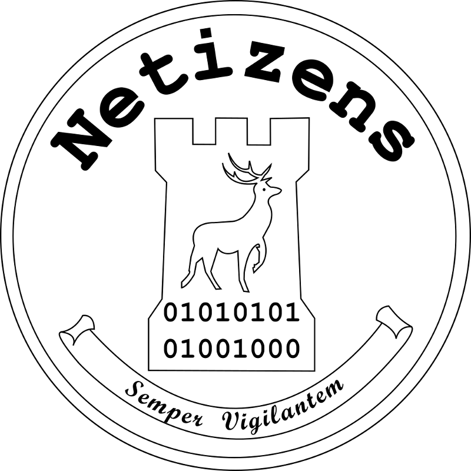

# What Is?

**TODO:** Definition of reverse engineering.

# Why?

**TODO:** Discuss NSA tool leak.

**TODO:** Discuss how WannaCry was deactivated.

**TODO:** Discuss broken compilers.

# Challengers

**TODO:** Discuss different OSes.

**TODO:** Discuss different architectures.

**TODO:** Discuss different compilers.

# Environment

**TODO:** Discuss about doing initial tests in VM.

**TODO:** Start with the assumption of using Kali Linux.

# Tools

**TODO:** List off useful tools.

**TODO:** Give an example.

# Start: Platform

**TODO:** Discuss platform discovery.

**TODO:** Give an example.

# Start: Architecture

**TODO:** Discuss architecture discovery.

**TODO:** Give an example.

# Start: Run it

**TODO:** See what the behaviour is and what it tries to do.

**TODO:** Give an example.

# Analysis: Debugger

**TODO:** Run the program with a debugger.

**TODO:** Give an example.

# Analysis: Decompile

**TODO:** Decompile the binary.

**TODO:** Give an example.

# Analysis: Source

**TODO:** Rebuilding the source files.

**TODO:** Give an example.

# Modification: Manual

**TODO:** Explain how modification is manually possible.

**TODO:** Give an example.

# Modification: Fuzzing

**TODO:** Explain how modification can be achieved with fuzzing.

**TODO:** Give an example.

# Modification: Source

**TODO:** Explain how to modify using the source.

**TODO:** Give an example.

# Questions

Any questions?

# About

This presentation was produced using `pdflatex` and `pandoc`. The source can be
found [here](https://github.com/danielbarry/presentations).
